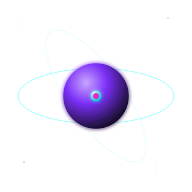

<div align="center">



</div>

<p align="center">
  <a href="https://linkedin.com/in/aryanprasad8888"></a>
  <a href="mailto:contact.aryan.p@gmail.com"></a>
  <a href="https://github.com/AryanExE-x"></a>
  
</p>

<div align="center">

</div>

<div align="center">

### 🛰️ MISSION CONTROL — QUICK NAV

[](#-crew-log)
[](#️-ship-modules)
[](#-telemetry)
[](#-star-map)
[](#-anomaly-detected)
[](#-cargo-bay)

</div>

---

## 📡 Crew Log

<table>
<tr>
<td width="60%" valign="top">

```yaml
> ssh crew@aryan-prasad.dev
> authenticating...
> access granted.

crew_member:
  name: Aryan Prasad
  callsign: AryanExE-x
  base: Vadodara, Gujarat, IN
  pronouns: he/him
  loadout: [DSA, Java, Python, Shell, AI-tooling]
  current_directive: "Grinding DSA daily, shipping side
    projects, exploring agentic dev tools
    (Claude Code / Codex / Gemini)."
  status: "404 :: motivation not found — recompiling."

log_entry:
  - "🔭 Building automation + backend tooling"
  - "🤖 Running agentic coding workflows on live projects"
  - "🌱 Leveling up system design + DSA pattern recall"
  - "💬 Open channel: DSA patterns · shell scripting ·
       tax-filing automation (see itr-wala)"
```

</td>
<td width="40%" align="center" valign="top">



</td>
</tr>
</table>

---

## ⚙️ Ship Modules

<div align="center">


<br/><br/>


</div>

<div align="center">

</div>

## 📊 Telemetry

<table>
<tr>
<td width="65%" valign="top">


</td>
<td width="35%" align="center" valign="top">



</td>
</tr>
</table>

<div align="center">


</div>

<details>
<summary>🏆 <b>DECRYPT TROPHY CACHE</b></summary>
<br/>

<div align="center">

</div>

</details>

---

## 🪐 Star Map

> 3D isometric render of the contribution calendar. Auto-regenerated daily by a GitHub Action — see `SETUP_GUIDE.md`.

<div align="center">

</div>

---

## 👾 Anomaly Detected

> Something is eating the contribution grid. GitHub Actions regenerates this every 12 hours.

<div align="center">
<picture>
  <source media="(prefers-color-scheme: dark)" srcset="https://raw.githubusercontent.com/AryanExE-x/AryanExE-x/output/github-contribution-grid-snake-dark.svg" />
  <source media="(prefers-color-scheme: light)" srcset="https://raw.githubusercontent.com/AryanExE-x/AryanExE-x/output/github-contribution-grid-snake.svg" />
  
</picture>
</div>

<div align="center">

</div>

## 🚀 Cargo Bay

<div align="center">

<a href="https://github.com/AryanExE-x/itr-wala">

</a>
<a href="https://github.com/AryanExE-x/Leetcode-DSA-Practice-Questions">

</a>
<br/>
<a href="https://github.com/AryanExE-x/Apna-College-AlphaBatch-DSA-JAVA">

</a>
<a href="https://github.com/AryanExE-x/skills">

</a>

</div>

> ⚠️ Private repos (like `Java-DSA`) can't render as pin cards — GitHub's card generator only reads public repo data. Make a repo public if you want it to show up here.

---

<details>
<summary>🎯 <b>MISSION OBJECTIVES — 2026</b></summary>

- [x] Build a profile that doesn't look like a corporate template
- [ ] Solve 300+ DSA problems
- [ ] Ship `itr-wala` to real users
- [ ] Land a PR on an open-source repo with 1k+ stars
- [ ] Get dangerous with agentic dev tooling

</details>

<details>
<summary>🃏 <b>TRANSMISSION FROM DEEP SPACE</b> (random dev quote)</summary>
<br/>

<div align="center">

</div>

</details>

---

<div align="center">


<br/>

<sub>TRANSMISSION ENDS · SIGNAL LOOP RESTARTS ON NEXT VISIT · 🛰️</sub>

</div>
