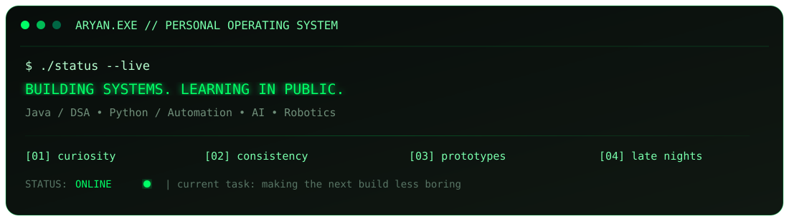
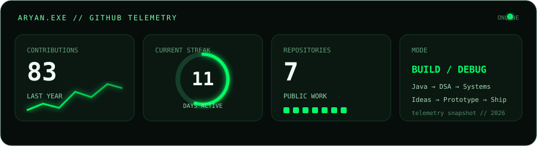

<div align="center">

<a href="https://github.com/AryanExE-x">

</a>

<br>


<br>

<a href="https://github.com/AryanExE-x?tab=repositories">

</a>
<a href="https://leetcode.com/">

</a>
<a href="mailto:contact.aryan.p@gmail.com">

</a>

<br><br>

<code>⚠ 404: motivation not found</code> &nbsp; <code>status: still shipping</code>

</div>

<br>




## `01` // THE PERSON BEHIND THE TERMINAL

> **I like taking things apart just enough to understand them — then rebuilding them better.**
>
> Right now that means living somewhere between **Java, DSA, automation, AI and hardware**.  
> I’m less interested in collecting technologies and more interested in making them **do something real**.

<details>
<summary><b>▸ decrypt personality.exe</b></summary>

<br>

```text
CURIOUS        ████████████████████  100%
STUBBORN       ██████████████████░░   90%
COFFEE         ███████████████████░   95%
MOTIVATION     ███████████░░░░░░░░░   55%
BUGS           █████████████████████  110%

preferred workflow:
idea → prototype → break it → stare at it → fix it → ship it
```

</details>

---

## `02` // CURRENTLY RUNNING

<table>
<tr>
<td width="50%" align="center">

### ☕ `JAVA_CORE`

**Building the fundamentals that don't disappear when the tutorial does.**

`OOP` · `Collections` · `DSA` · `Problem Solving`

</td>
<td width="50%" align="center">

### 🧠 `DSA_ENGINE`

**Learning to turn “I have no idea” into a sequence of smaller problems.**

`Arrays` · `Linked Lists` · `Binary Search` · `Patterns`

</td>
</tr>
<tr>
<td width="50%" align="center">

### 🤖 `HARDWARE_LAB`

**Where software gets to leave the screen.**

`Drones` · `Robotics` · `Automation` · `Computer Vision`

</td>
<td width="50%" align="center">

### ⚡ `AI_PLAYGROUND`

**Experimenting before deciding what deserves to become a project.**

`Python` · `AI` · `Automation` · `Experiments`

</td>
</tr>
</table>

---

## `03` // PROJECTS WITH A PULSE

<details open>
<summary><b>🚁 FIRE-RESPONSE DRONE — mission in progress</b></summary>

<br>

**The idea:** build technology that has a reason to exist outside a GitHub repository.

I'm exploring a fire-response drone system around **automation, sensing, computer vision and real-world constraints**.

```text
OBJECTIVE     → emergency-response assistance
CURRENT MODE  → research / prototype
HARD PART     → making software behave in the physical world
NEXT TARGET   → better sensing + smarter automation
```

</details>

<details>
<summary><b>☕ JAVA + DSA — the fundamentals arc</b></summary>

<br>

A public trail of the problems I'm solving while turning Java syntax into actual problem-solving ability.

**Not just solutions → patterns, mistakes, optimizations, repetition.**

<a href="https://github.com/AryanExE-x/Java-DSA">OPEN JAVA-DSA →</a>

</details>

<details>
<summary><b>🧩 LEETCODE — controlled suffering</b></summary>

<br>

A growing collection of interview-style problems.

The goal isn't to memorize 500 solutions.

**The goal is to recognize the 20 patterns hiding inside them.**

<a href="https://github.com/AryanExE-x/Leetcode-DSA-Practice-Questions">OPEN PRACTICE REPO →</a>

</details>

<details>
<summary><b>⚙️ AUTOMATION — make the computer do the boring part</b></summary>

<br>

Small experiments around scripting, workflows and systems that remove repetitive work.

Sometimes they save time.

Sometimes they create a completely different bug.

**Both are educational.**

</details>

---

## `04` // TECH STACK

<div align="center">


<br><br>

<code>JAVA</code> &nbsp; <code>DSA</code> &nbsp; <code>PYTHON</code> &nbsp; <code>AI</code> &nbsp; <code>AUTOMATION</code> &nbsp; <code>ROBOTICS</code>

</div>

---

## `05` // GITHUB TELEMETRY

<div align="center">



<br>

<sub><code>TELEMETRY</code> is a snapshot of the machine behind the commits — not a vanity scoreboard.</sub>

</div>

<details>
<summary><b>▸ read the signal</b></summary>

<br>

```text
83  contributions    →  consistency is starting to compound
11  day streak       →  showing up > waiting for motivation
07  repositories     →  experiments, practice, and actual builds
02  stars            →  small number, real signal
```

</details>

---

## `06` // CONTRIBUTION MATRIX

<div align="center">


<sub>live contribution animation — the matrix updates automatically after the GitHub Action runs.</sub>

</div>

---

## `07` // TERMINAL ACCESS

<details>
<summary><b>🟢 $ ./whoami</b></summary>

```console
Aryan Prasad
├── alias       : AryanExE-x
├── primary     : Java / DSA
├── exploring   : Python / AI / Automation
├── hardware    : Robotics / Drones
└── current_op  : becoming better than yesterday
```

</details>

<details>
<summary><b>🟢 $ ./debug --life</b></summary>

```console
[00:01] motivation.exe .............. NOT FOUND
[00:02] coffee dependency .......... RESOLVED
[00:03] compiler ................... ONLINE
[00:04] confidence ................. UNSTABLE
[00:05] bug count .................. CLASSIFIED
[00:06] solution ................... "why did that work?"
[00:07] commit ..................... PUSHED

SYSTEM: operational.
```

</details>

<details>
<summary><b>🟢 $ ./java --run-aryan</b></summary>

```java
while (alive) {
    learn();
    build();
    fail();
    debug();
    repeat();
}
```

</details>

---

## `08` // OPEN PORTS

<div align="center">


<br>

<a href="https://www.linkedin.com/in/aryanprasad8888">

</a>
&nbsp;
<a href="mailto:contact.aryan.p@gmail.com">

</a>
&nbsp;
<a href="https://github.com/AryanExE-x?tab=repositories">

</a>

<br><br>

<code>connection.established()</code>

<br><br>

<sub>Got an idea worth building? Send the signal.</sub>

</div>
