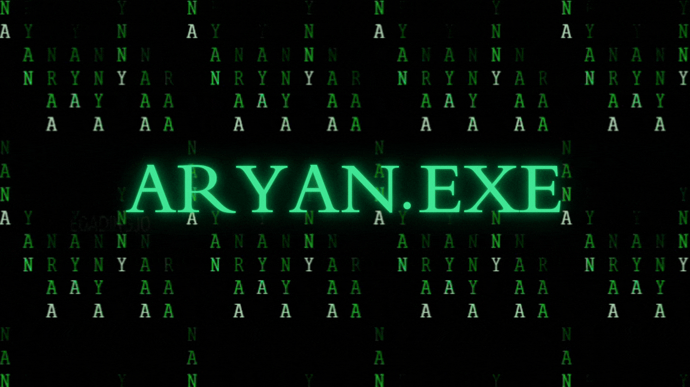

<div align="center">

<!-- ===================== HERO ===================== -->


<br/>


<br/>

<a href="https://github.com/AryanExE-x">
  
</a>
<a href="mailto:contact.aryan.p@gmail.com">
  
</a>
<a href="https://www.linkedin.com/in/aryanprasad8888">
  
</a>

<br/><br/>

<code>⚠️ 404: MOTIVATION NOT FOUND</code>
<br/>
<sub><code>Currently debugging life.java...</code></sub>

</div>

---

## `~/AryanExE-x` → `cat about_me.log`

```text
┌──────────────────────────────────────────────────────────────────────┐
│  ~/AryanExE-x  git:(main)  ✗                                         │
│                                                                      │
│  $ whoami                                                            │
│  > Aryan Prasad                                                      │
│                                                                      │
│  $ cat status.log                                                    │
│  > Role       : Aspiring Developer                                   │
│  > Primary    : Java + DSA                                          │
│  > Exploring  : Python + AI + Automation                             │
│  > Building   : Robotics / Drone Systems                             │
│  > Mode       : BUILD → BREAK → DEBUG → REPEAT                       │
│                                                                      │
│  $ uptime                                                            │
│  > compiling since forever...                                       │
└──────────────────────────────────────────────────────────────────────┘
```

<div align="center">

### `// I don't just learn concepts. I try to make them survive production.`

</div>

---

## `./mission_control`

<table>
<tr>
<td width="50%" valign="top">

### 🛰️ `currently_working_on[]`

- 🚁 Fire-response drone systems
- 🧠 Data Structures & Algorithms
- ⚙️ Automation projects
- 🧪 Turning ideas into working prototypes

</td>
<td width="50%" valign="top">

### 🌱 `currently_learning[]`

- ☕ Java
- 🧩 DSA
- 🐍 Python
- 🤖 AI & Automation
- 🏗️ Backend architecture

</td>
</tr>
<tr>
<td width="50%" valign="top">

### 🤝 `looking_to_collab[]`

- 🤖 Robotics & Drones
- 🧠 Artificial Intelligence
- 🔓 Open-source projects
- ⚡ Weird-but-useful ideas

</td>
<td width="50%" valign="top">

### 🧩 `need_help_with[]`

- Drone systems
- Computer vision
- Backend architecture
- Building things at unreasonable hours

</td>
</tr>
</table>

---

## `./stack --scan`

<div align="center">


<br/><br/>


</div>

---

## `./projects --featured`

<table>
<tr>
<td width="50%" valign="top">

### 🚒 Fire-Response Drone
**Mission:** explore autonomous systems for emergency response.

`robotics` `automation` `computer-vision`

</td>
<td width="50%" valign="top">

### ☕ Java + DSA Lab
A growing collection of implementations, patterns and interview-style problems.

`java` `dsa` `algorithms`

</td>
</tr>
<tr>
<td width="50%" valign="top">

### 🧠 LeetCode Practice
Solutions and patterns I'm using to sharpen problem-solving.

`java` `leetcode` `problem-solving`

</td>
<td width="50%" valign="top">

### ⚙️ Automation Experiments
Small systems that remove repetitive work and occasionally create new bugs.

`python` `automation` `experiments`

</td>
</tr>
</table>

> **Want to see the real work?** Check the repositories below — the README is the interface, the commits are the evidence.

---

## `./github --telemetry`

<div align="center">


<br/><br/>


</div>

---

## `./achievements --load`

<div align="center">


</div>

---

## `./contributions --animate`

<div align="center">



</div>

<details>
<summary><b>🐍 What is this?</b></summary>

<br/>

This animation is generated automatically from the GitHub contribution graph by the workflow included with this profile.

Every commit feeds the snake.

Every empty square is a personal attack.

</details>

---

## `./terminal --interactive`

<details>
<summary><b>🟢 Open terminal session</b></summary>

```console
$ ./aryan.exe

[BOOT] loading developer profile...
[OK]   Java runtime detected
[OK]   DSA module detected
[OK]   caffeine dependency detected
[WARN] motivation dependency missing
[OK]   debugging subsystem online

> ./build --project="something-that-shouldn't-be-easy"

Compiling ███████████████████░ 94%

ERROR:
    Unknown bug detected.

ACTION:
    Debug it.

RESULT:
    It works now. Don't ask why.

$ echo $NEXT_STEP

BUILD SOMETHING HARDER.
```

</details>

<details>
<summary><b>☕ Java developer mode</b></summary>

```java
public class Aryan {
    public static void main(String[] args) {

        while (alive()) {
            learn();
            build();
            breakSomething();
            debug();
            repeat();
        }
    }
}
```

</details>

<details>
<summary><b>🧠 Ask me about</b></summary>

- Java
- DSA
- Fire-response drone systems
- Automation
- AI experiments
- Things I'm secretly building at 2 AM

</details>

---

## `./connect --open_channels`

<div align="center">

<a href="https://www.linkedin.com/in/aryanprasad8888">

</a>
<a href="mailto:contact.aryan.p@gmail.com">

</a>
<a href="https://github.com/AryanExE-x">

</a>

<br/><br/>

### `> connection established.`

<sub>Building quietly. Committing consistently. Learning in public.</sub>

<br/>


</div>
